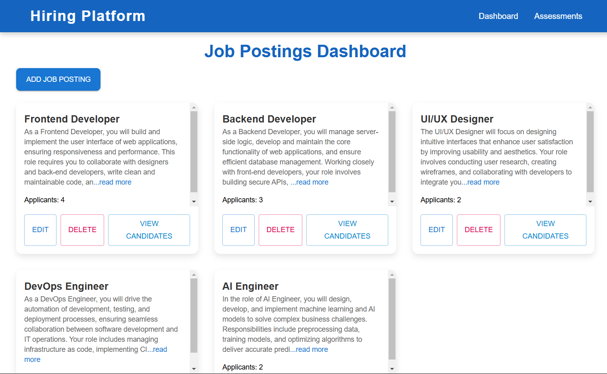
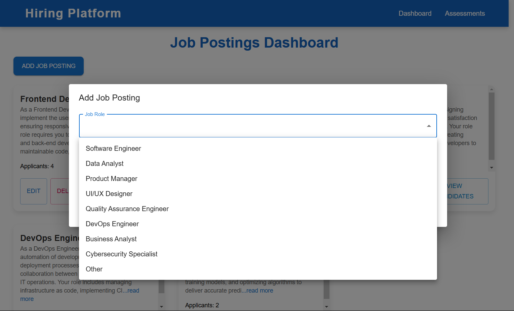
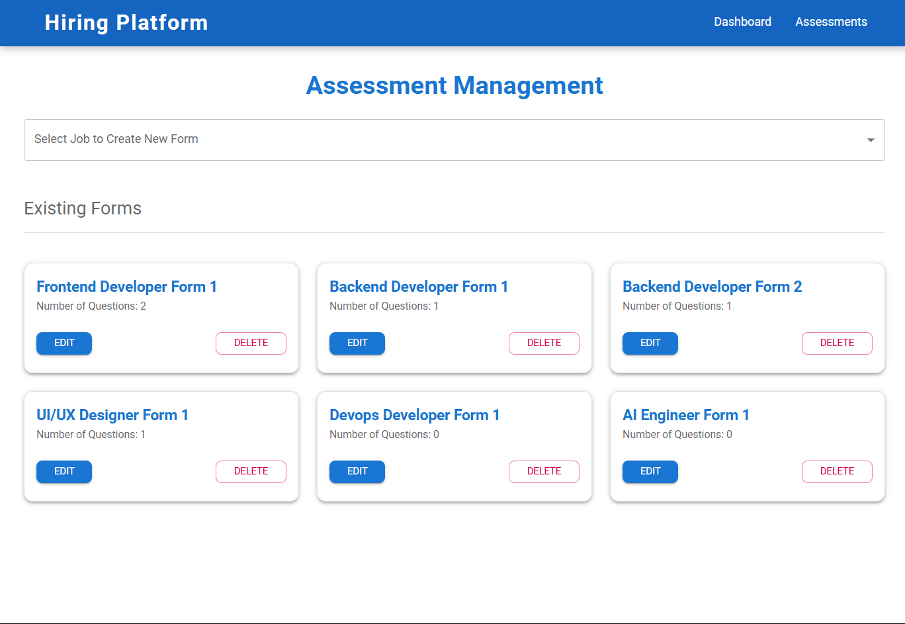
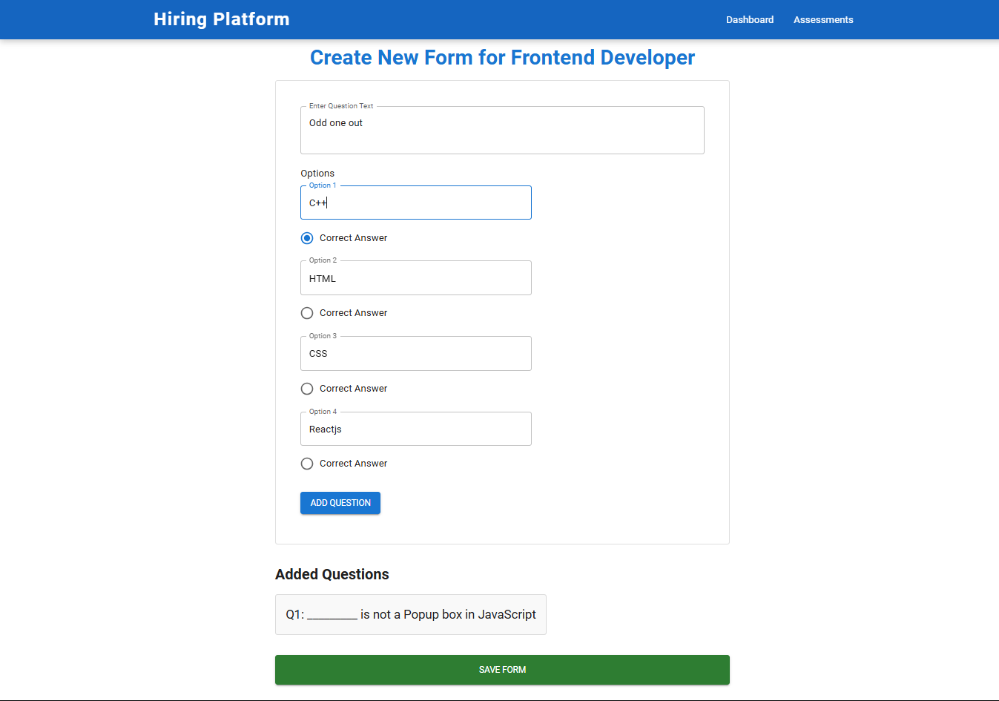
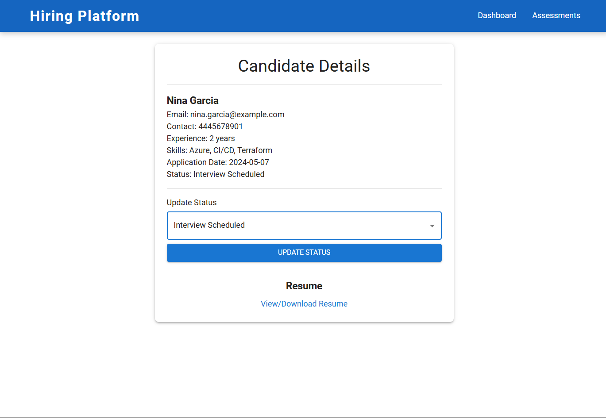
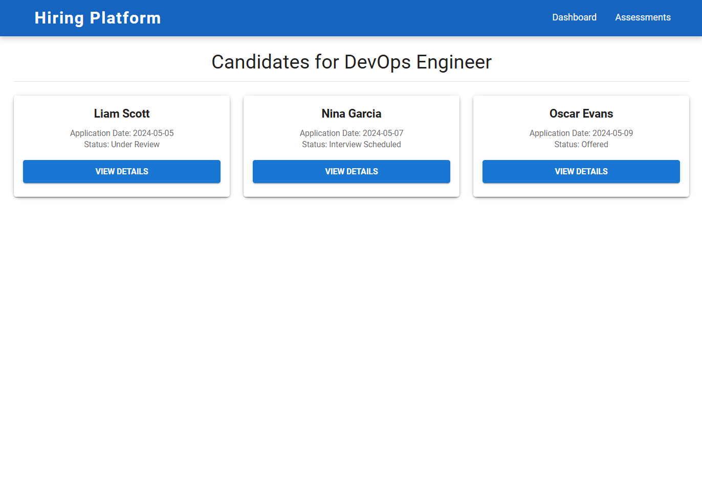

# Job Management and Assessment Dashboard

## Overview
The Job Management and Assessment Dashboard is a web application built with React and Material-UI that allows users to manage job roles for an organization. Additionally, it enables creating assessments for job roles, including adding and managing questions within each assessment. Data is stored in local storage, ensuring persistence across browser sessions.

## Features
- **Add New Job Role**: Add new job roles with descriptions and an initial count of applicants.
- **View Job Roles**: Display all job roles with descriptions and number of applicants.
- **Edit Job Role**: Modify the name and description of an existing job role.
- **Delete Job Role**: Remove a job role from the list.
- **Add Assessment for Job Roles**: Create assessments specific to each job role.
- **Add Questions in Assessment**: Add questions to each assessment, allowing for detailed role-specific assessments.
- **View Candidates**: Display a list of candidates associated with a specific job role.
- **Local Storage Persistence**: Data is stored in local storage, maintaining changes across browser sessions.

## Technologies Used
- **React**: JavaScript library for building user interfaces.
- **Material-UI**: UI library providing Material Design components for faster and more efficient development.
- **localStorage**: Used to store job role and assessment data persistently within the browser.

## Available Scripts
In the project directory, you can run:

### `npm start`
Runs the app in development mode.  
Open [http://localhost:3000](http://localhost:3000) to view it in your browser.  
The page will automatically reload if you make changes to the code.  
You may also see any lint errors in the console.

### `npm test`
Launches the test runner in interactive watch mode.  
See more about testing in the React documentation.

### `npm run build`
Builds the app for production in the `build` folder.  
It correctly bundles React in production mode, optimizing for best performance.  
The build is minified, and the filenames include hashes.  
Your app is ready to be deployed!

### `npm run eject`
Note: This is a one-way operation. Once you eject, you can't go back!  
If you want full control over the build configuration, you can eject the app, which will copy all configuration files and dependencies into your project.

## Installation
### Clone the Repository

git clone 
```https://github.com/your-username/job-management-dashboard.git```

cd job-management-dashboard


## Usage

### Adding a New Job Role
1. Navigate to the Dashboard.
2. Fill in the job role name and description in the form at the top.
3. Submit the form to add the job role to the list.

### Adding an Assessment
1. Select the job role for which you want to create an assessment.
2. Add an assessment by specifying the assessment title and description.

### Adding Questions to Assessment
1. Open an existing assessment for a job role.
2. Use the form to add questions to the assessment.

### Viewing Job Roles and Candidates
- Job roles are displayed on the Dashboard, showing their names, descriptions, and the number of applicants.
- View candidate details for each job role on the Candidates page.

## Project Structure
Below is a high-level overview of the main project structure:

src/
├── components/
│   ├── assessment/
│   │   ├── existingFormList.jsx          # Displays a list of existing assessment forms
│   │   ├── FormCard.jsx                  # Card component for displaying individual form details
│   │   ├── jobDropdown.jsx               # Dropdown component for job selection
│   │   └── jobFormCreator.jsx            # Component for creating new job assessment forms
│   │
│   ├── candidates/
│   │   ├── candidateInfo.jsx             # Displays candidate details
│   │   ├── jobData.jsx                   # Contains static data related to job roles and candidates
│   │   └── statusUpdate.jsx              # Component for updating candidate status
│   │
│   ├── dashboard/
│   │   ├── displayJobData.jsx            # Displays data related to job postings on the dashboard
│   │   ├── jobDialog.jsx                 # Dialog component for adding or editing job postings
│   │   ├── jobForm.jsx                   # Form component for creating or editing job postings
│   │   └── Navbar.js                     # Navigation bar for the application
│   
├── pages/
│   ├── assessmentPage.jsx                # Page for managing assessment forms
│   ├── candidateDetailPage.jsx           # Page displaying detailed information for a specific candidate
│   ├── CandidateListPage.jsx             # Page listing all candidates for a specific job
│   ├── dashboardPage.jsx                 # Main dashboard page component
│   ├── EditFormPage.jsx                  # Page for editing existing assessment forms
│   ├── jobDetailPage.jsx                 # Page showing details of a specific job role
│   ├── NewFormPage.jsx                   # Page for creating a new form
│   └── notFoundPage.jsx                  # 404 page for unmatched routes
│
├── App.js                                # Main application component
├── index.js                              # Entry point for React app
└── README.md                             # Project README


## Screenshots

Including screenshots gives users a better understanding of the project and its functionalities. Below are some screenshots:

- **Dashboard View**
  

- **Add Job Role Form**
  

- **Assessment Form**
 

- **Question Form**
  

- **Candidate View**
  

- **All Candidates View**
  


## Demo

A live demo of the project is available on Vercel: [Job Management and Assessment Dashboard](https://hiring-platform-ten.vercel.app/)

## Future Improvements

- **Search and Filter**: Add search and filtering capabilities to make it easier to locate specific job roles.
- **Applicant Management**: Implement the ability to add, edit, and delete applicants for each job role.
- **Database Integration**: Use a backend database to enable multi-user support and server-side persistence.

## License

This project is licensed under the MIT License. See the LICENSE file for details.

## Acknowledgements

- **React**: JavaScript library for building user interfaces.
- **Material-UI**: A popular React UI framework implementing Material Design.
