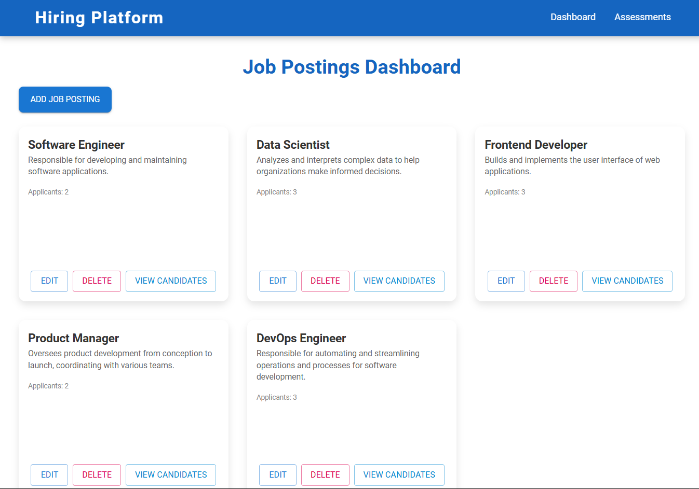

---

# Job Management Dashboard



## Overview

The **Job Management Dashboard** is a web application built with React and Material-UI that allows users to manage job roles for an organization. The app includes features to add, view, edit, and delete job roles, each with descriptions and applicant counts. Data is stored in local storage, ensuring persistence across browser sessions.

## Features

- **Add New Job Role**: Add new job roles with descriptions and an initial count of applicants.
- **View Job Roles**: Display all job roles with descriptions and number of applicants.
- **Edit Job Role**: Modify the name and description of an existing job role.
- **Delete Job Role**: Remove a job role from the list.
- **Local Storage Persistence**: Data is stored in local storage, maintaining changes across browser sessions.

## Technologies Used

- **React**: JavaScript library for building user interfaces.
- **Material-UI**: UI library providing Material Design components for faster and more efficient development.
- **localStorage**: Used to store job role data persistently within the browser.

## Available Scripts

In the project directory, you can run:

### `npm start`

Runs the app in development mode.\
Open [http://localhost:3000](http://localhost:3000) to view it in your browser.

The page will automatically reload if you make changes to the code.\
You may also see any lint errors in the console.

### `npm test`

Launches the test runner in interactive watch mode.\
See more about testing in the [React documentation](https://reactjs.org/docs/testing.html).

### `npm run build`

Builds the app for production in the `build` folder.\
It correctly bundles React in production mode, optimizing for best performance.

The build is minified, and the filenames include hashes.\
Your app is ready to be deployed!

### `npm run eject`

**Note**: This is a one-way operation. Once you `eject`, you can't go back!

If you want full control over the build configuration, you can `eject` the app, which will copy all configuration files and dependencies into your project.

## Installation

### Clone the Repository

```bash
git clone https://github.com/your-username/job-management-dashboard.git
cd job-management-dashboard
```

### Install Dependencies

Make sure you have Node.js installed. Then, install the required dependencies:

```bash
npm install
```

### Start the Application

To run the development server, use:

```bash
npm start
```

This will start the app at `http://localhost:3000`.

## Usage

### Adding a New Job Role
1. Navigate to the Dashboard.
2. Fill in the job role name and description in the form at the top.
3. Submit the form to add the job role to the list.

### Viewing Job Roles
- All job roles are displayed on the Dashboard, showing their names, descriptions, and the number of applicants.

### Editing a Job Role
1. Click the **Edit** button on a job role card to open the edit form.
2. Modify the job role name or description as needed.
3. Click **Save** to update the role.

### Deleting a Job Role
- Click the **Delete** button on a job role card to remove it from the list.

## Project Structure

Below is a high-level overview of the main project structure:

```plaintext
src/
├── components/
│   ├── dashboard/
│   │   ├── DashboardPage.jsx        # Main dashboard page component
│   │   └── NewJobForm.jsx           # Form component for adding new job roles
│   ├── JobRolesDisplay.jsx          # Component for displaying job roles with edit and delete options
├── data/
│   └── jobData.jsx                  # Contains initial job role data
├── App.js                           # Main application component
├── index.js                         # Entry point for React app
└── README.md                        # Project README
```

## Screenshots

Including screenshots gives users a better understanding of the project and its functionalities. Below are examples of how you can include screenshots:

### Dashboard View


### Add Job Role Form


### Edit Job Role Dialog


> **Note**: Create a `screenshots` folder in your project root and add images there.

## Future Improvements

- **Search and Filter**: Add search and filtering capabilities to make it easier to locate specific job roles.
- **Applicant Management**: Implement the ability to add, edit, and delete applicants for each job role.
- **Database Integration**: Use a backend database to enable multi-user support and server-side persistence.

## License

This project is licensed under the MIT License. See the [LICENSE](LICENSE) file for details.

## Acknowledgements

- [React](https://reactjs.org/) - JavaScript library for building user interfaces.
- [Material-UI](https://mui.com/) - A popular React UI framework implementing Material Design.

---

